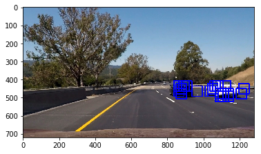
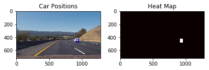

## Writeup

---

**Vehicle Detection Project**

The goals / steps of this project are the following:

* Perform a Histogram of Oriented Gradients (HOG) feature extraction on a labeled training set of images and train a classifier Linear SVM classifier
* Optionally, you can also apply a color transform and append binned color features, as well as histograms of color, to your HOG feature vector. 
* Note: for those first two steps don't forget to normalize your features and randomize a selection for training and testing.
* Implement a sliding-window technique and use your trained classifier to search for vehicles in images.
* Run your pipeline on a video stream (start with the test_video.mp4 and later implement on full project_video.mp4) and create a heat map of recurring detections frame by frame to reject outliers and follow detected vehicles.
* Estimate a bounding box for vehicles detected.

## [Rubric](https://review.udacity.com/#!/rubrics/513/view) Points
### Here I will consider the rubric points individually and describe how I addressed each point in my implementation.  

---
### Writeup / README

#### 1. Provide a Writeup / README that includes all the rubric points and how you addressed each one.  You can submit your writeup as markdown or pdf.  [Here](https://github.com/udacity/CarND-Vehicle-Detection/blob/master/writeup_template.md) is a template writeup for this project you can use as a guide and a starting point.  

You're reading it!

### Histogram of Oriented Gradients (HOG)

#### 1. Explain how (and identify where in your code) you extracted HOG features from the training images.

The function to extract HOG features is in the Helper Functions cell of the `CarND-Vehicle-Detection.ipynb` notebook. This is used in both `extract_features()` and `find_cars()` methods. During Training, the input images are the vehicles themselves so I extracted HOG features form the entire image. During inference, on the other hand, since we are supposed to detect cars within the entire image, I took HOG features on the whole image and then took took sub samples for sliding windows.

I then explored different color spaces and different `skimage.hog()` parameters (`orientations`, `pixels_per_cell`, and `cells_per_block`).  I grabbed random images from each of the two classes and displayed them to get a feel for what the `skimage.hog()` output looks like.

Here is an example using the `YCrCb` color space and HOG parameters of `orientations=9`, `pixels_per_cell=(8, 8)` and `cells_per_block=(2, 2)`:

#### 2. Explain how you settled on your final choice of HOG parameters.

I tried different parameters for pixels per cell and cells per block and was getting worse results.

#### 3. Describe how (and identify where in your code) you trained a classifier using your selected HOG features (and color features if you used them).

I stacked the HOG features along with spatial binning and histogram features for a feature vector of size 8556.

### Sliding Window Search

#### 1. Describe how (and identify where in your code) you implemented a sliding window search.  How did you decide what scales to search and how much to overlap windows?
Since cars are most likely to occur close to the center of the image, I took a smaller sample of the main image to search. I then applied HOG transform to the that sample and then implemented a sliding window detector.

#### 2. Show some examples of test images to demonstrate how your pipeline is working.  What did you do to optimize the performance of your classifier?

I only searched on a single scale using YCrCb 3-channel HOG features plus spatially binned color and histograms of color in the feature vector.

### Video Implementation

#### 1. Provide a link to your final video output.  Your pipeline should perform reasonably well on the entire project video (somewhat wobbly or unstable bounding boxes are ok as long as you are identifying the vehicles most of the time with minimal false positives.)
I trained the model twice, once with just the KITTI Dataset and one with the KITTI dataset + Unique GTI Right Vehicle images (had to manually delete sequential pictures).

The first result can be found [here](./project_video_out_full.mp4). When trained with the KITTI dataset, the model was very confident with detecting vehicles. It did not have any false positives, but rather had false negatives, where it wouldn't recognize a car at times. I set the heat threshold to zero.

Here's a [link to to the second video result](./project_video_out_full_1.mp4). This model was trained with KITT+GTI, and this one detects quite a few false positives. The heat threshold was set to 1. This model was less strict than the earlier one, with some false positives but this also detects oncoming traffic.

I didn't have to attempt multiple scales so far but I think the model trained on KITTI with multiple scales would perform better.

EDIT:
I tuned some parameters better and ended up getting better results. I now used three different scales for prediction and a heatmap threshold of 3([video](./project_video_out_full_2.mp4)) and 4([video](./project_video_out_full_3.mp4)).

EDIT2: I used deque to store a heatmap history for the the last 8 frames. I then took the average and then applied the threshold. This greatly removed false positives and reduced jitter in bounding boxes. ([video](./project_video_out_full_4.mp4), the false positives in the beginning of the video are from forgetting to clear the deque from thre previous block. They disappear after a few frames.)

#### 2. Describe how (and identify where in your code) you implemented some kind of filter for false positives and some method for combining overlapping bounding boxes.

I recorded the positions of positive detections in each frame of the video.  From the positive detections I created a heatmap and then thresholded that map to identify vehicle positions.  I then used `scipy.ndimage.measurements.label()` to identify individual blobs in the heatmap.  I then assumed each blob corresponded to a vehicle.  I constructed bounding boxes to cover the area of each blob detected.

### Heres a heatmap on a test image:

---

### Discussion

#### 1. Briefly discuss any problems / issues you faced in your implementation of this project.  Where will your pipeline likely fail?  What could you do to make it more robust?

From what I understood from using different datasets with this method, my pipeline might perform worse if there is a change in weather or brightness of the scene. The amount of preprocessing that happens to the image before actually implementing the SVM is rather resource intensive and takes a lot of time for inference. I initially used GridSearch with an rbf kernel and it performed better before realizing I was supposed to stick to Linear SVM for the project. This method can be further improved by reducing the search window once the first detection has been made to increase prediction speed and also to reduce false positives (like we did in the advanced lane finding project)

I believe using a Neural Network like YOLO, SSD or RCNN would perform better for a task like this.

